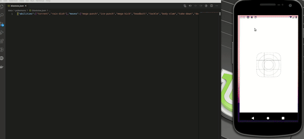

# Pokedex

> An end to end JavaScript app for learning all about Kanto Pokemons .

BackEnd built with node.js and express, FrontEnd with React-Native (powerd by expo for native platfrom, and react-scripts serves a DOM template for web OS)



## Installation

> After cloning the repo

- BackEnd

  ```sh
  $ cd ~/pokedex
  $ npm i
  $ npm start
  ```

> On new terminal

- FrontEnd

  ```sh
    $ cd ~/pokedex/client
    $ npm i
  ```

  - For running through a mobile emulator type,

    ```sh
    $ npm start
    ```

    Expo developer tools client should open in a browser window.

    Alternativly, you can directly run

    ```sh
     $ npm run android
    ```

    (App havn't been tested on iOS OS)

  - For running on web, uncomment

    ```sh
    app.use(cors(corsOptions)); // line 41
    ```

    at `~/pokedex/index.js` and run server again. In case your front end isn't running on port 3000, add your port to `whiteList` domains at this file

    and type

    ```sh
    $ npm run web
    ```

## Feauters

- Lazy loading - The app gets the pokemons list in chunks of 10 pokemons, while `onEndReached` `FlatList` prop calling for the next chunck from the server

- Real-Time functionality - `fs.watchFile` listening for real-time updates in the data, and through `socket.io` socket sends the updated information to the client side

* Dark Mode - App wrapped inside `styleContext` for easily maintain both dynanic and constant styles

* Routing for both native and web platforms thanks to `react-router` packages
